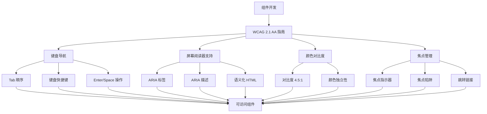
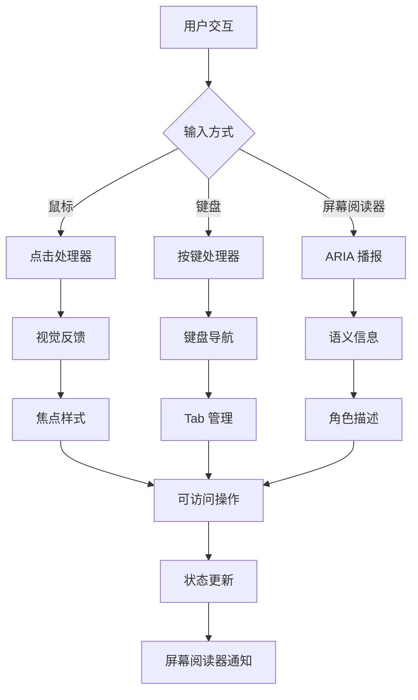
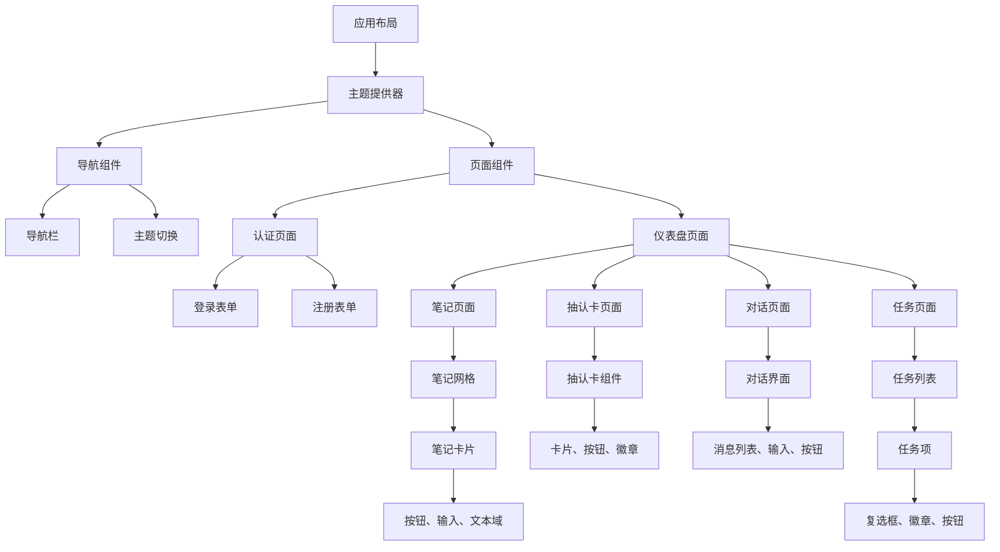
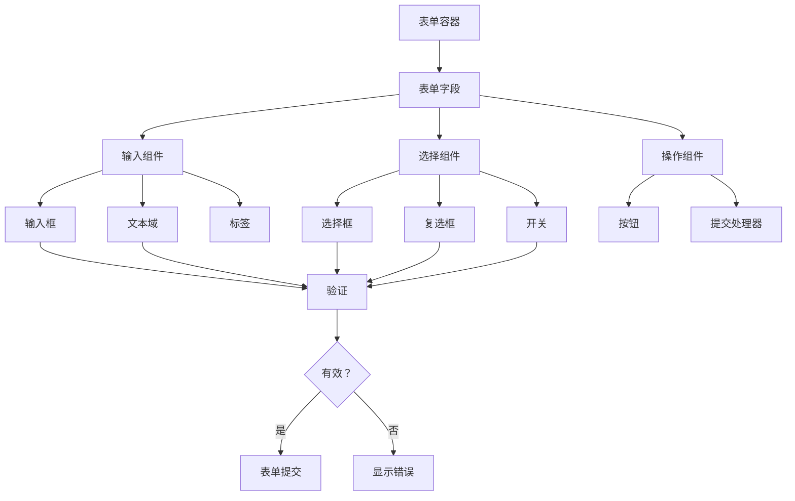
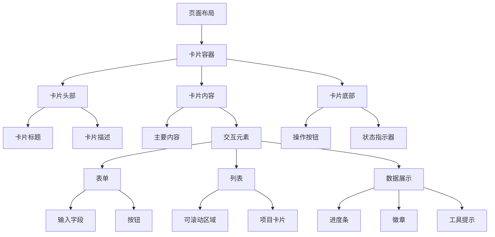
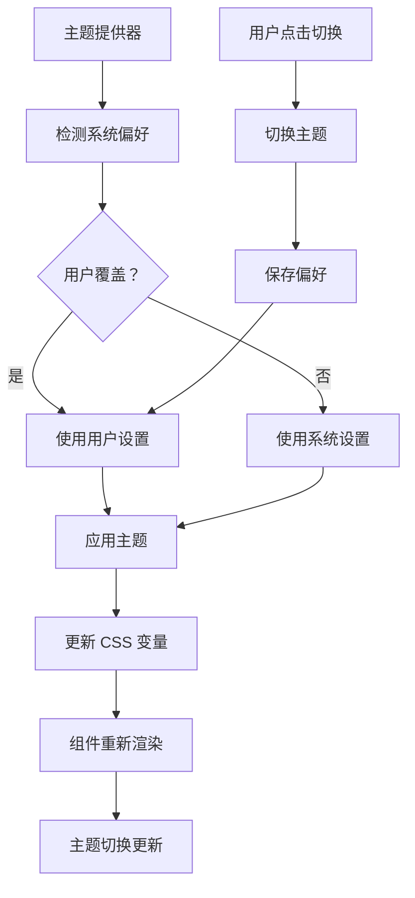
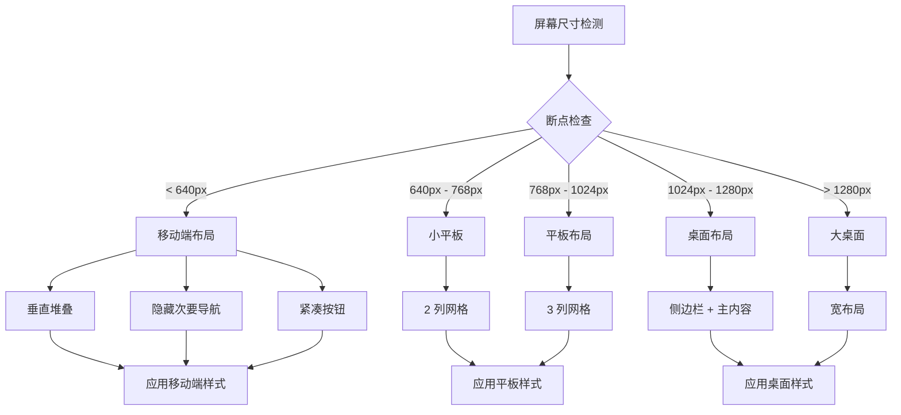

# UI 组件

## 🎨 设计系统

Study Sphere 使用 Tailwind CSS 和 Radix UI 原语来构建一致、可访问的组件。

## 🏗️ 组件结构

```
src/components/ui/       # 基础 UI 组件
├── button.tsx          # 按钮变体
├── card.tsx           # 容器组件
├── dialog.tsx         # 模态对话框
├── input.tsx          # 表单输入
├── textarea.tsx       # 文本域
├── select.tsx         # 下拉选择
├── checkbox.tsx       # 复选框
├── switch.tsx         # 切换开关
├── badge.tsx          # 状态徽章
├── progress.tsx       # 进度条
├── flashcard.tsx      # 自定义抽认卡组件
└── ...               # 其他 UI 原语
```

## 🎯 设计令牌

### 颜色
- **主色**：深色文本和按钮
- **辅色**：浅色背景
- **柔和色**：细微背景
- **强调色**：高亮元素
- **破坏色**：错误状态

### 排版
- **Sans**：Geist Sans（主字体）
- **Mono**：Geist Mono（代码字体）

## 🧩 关键组件

### 按钮组件
```typescript
const buttonVariants = cva(
  "inline-flex items-center justify-center rounded-md text-sm font-medium",
  {
    variants: {
      variant: {
        default: "bg-primary text-primary-foreground hover:bg-primary/90",
        destructive: "bg-destructive text-destructive-foreground",
        outline: "border border-input hover:bg-accent",
        secondary: "bg-secondary text-secondary-foreground",
        ghost: "hover:bg-accent hover:text-accent-foreground",
        link: "text-primary underline-offset-4 hover:underline",
      },
      size: {
        default: "h-10 px-4 py-2",
        sm: "h-9 rounded-md px-3",
        lg: "h-11 rounded-md px-8",
        icon: "h-10 w-10",
      },
    },
  }
);
```

### 卡片组件
```typescript
const Card = React.forwardRef<
  HTMLDivElement,
  React.HTMLAttributes<HTMLDivElement>
>(({ className, ...props }, ref) => (
  <div
    ref={ref}
    className={cn(
      "rounded-lg border bg-card text-card-foreground shadow-sm",
      className
    )}
    {...props}
  />
));
```

## 🎨 主题支持

### 深色/浅色模式
- 系统偏好检测
- 手动主题切换
- 一致的配色方案
- 可访问的对比度比率

### CSS 变量
```css
:root {
  --background: 0 0% 100%;
  --foreground: 222.2 84% 4.9%;
  --card: 0 0% 100%;
  --card-foreground: 222.2 84% 4.9%;
  --primary: 222.2 47.4% 11.2%;
  --primary-foreground: 210 40% 98%;
}

.dark {
  --background: 222.2 84% 4.9%;
  --foreground: 210 40% 98%;
  --card: 222.2 84% 4.9%;
  --card-foreground: 210 40% 98%;
  --primary: 210 40% 98%;
  --primary-foreground: 222.2 47.4% 11.2%;
}
```

## ♿ 可访问性功能

### 可访问性实现流程


### 组件可访问性流程


## 📱 响应式设计

- 移动优先方法
- 断点系统：
  - `sm`：640px
  - `md`：768px
  - `lg`：1024px
  - `xl`：1280px
  - `2xl`：1536px

## 🎯 组件使用

### 组件层次流程


### 表单组件流程


### 布局组件流程


### 主题系统流程


### 响应式设计流程


### 带组件的表单示例
```tsx
<form>
  <Input placeholder="输入文本..." />
  <Textarea placeholder="输入描述..." />
  <Select>
    <SelectItem value="option1">选项 1</SelectItem>
  </Select>
  <Button type="submit">提交</Button>
</form>
```

### 带组件的布局示例
```tsx
<Card>
  <CardHeader>
    <CardTitle>标题</CardTitle>
  </CardHeader>
  <CardContent>
    内容在此处
  </CardContent>
</Card>
```

## 🔧 配置

组件通过 `components.json` 配置：
```json
{
  "style": "default",
  "rsc": true,
  "tsx": true,
  "tailwind": {
    "config": "tailwind.config.ts",
    "css": "src/app/globals.css",
    "baseColor": "slate",
    "cssVariables": true
  },
  "aliases": {
    "components": "@/components",
    "utils": "@/lib/utils"
  }
}
```
