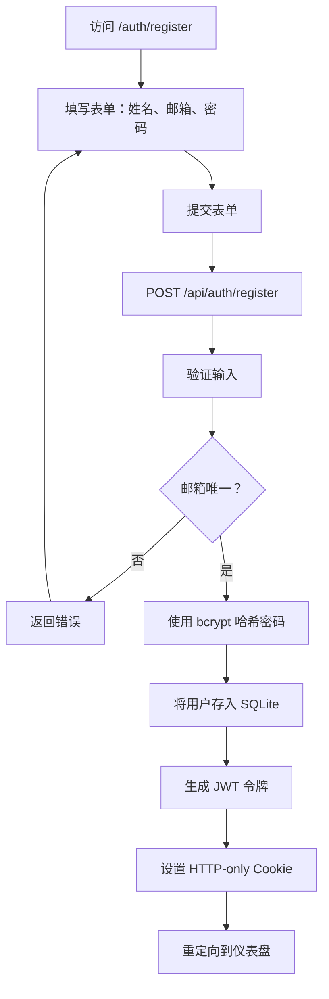
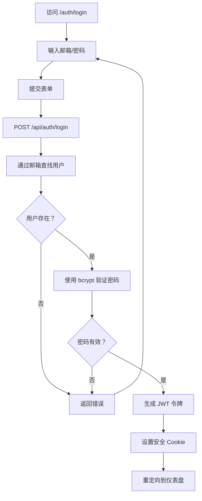
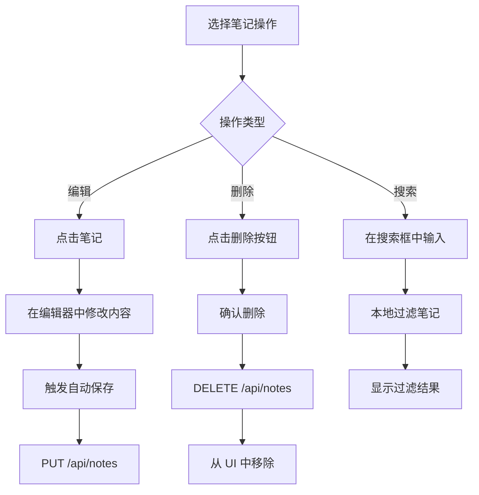
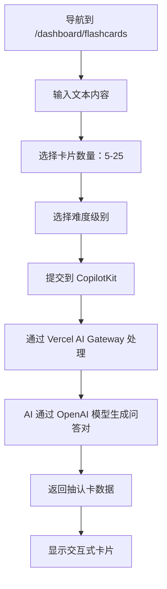
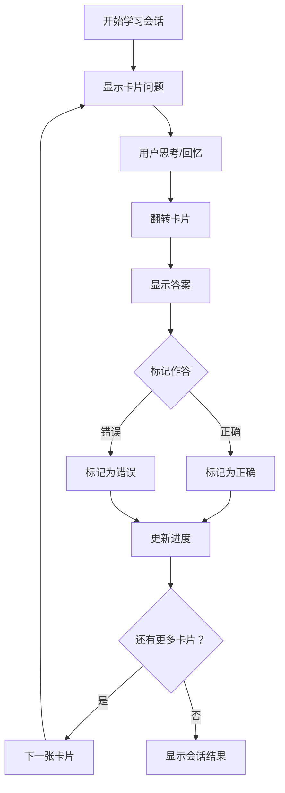
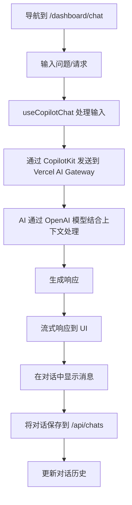
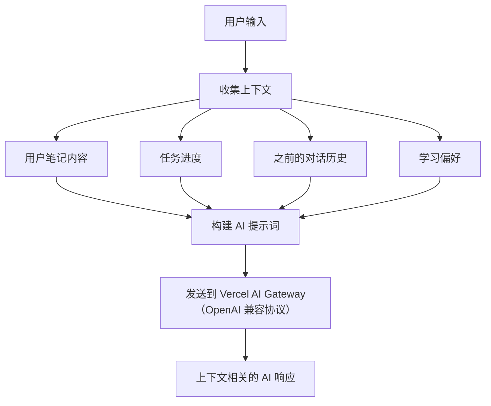
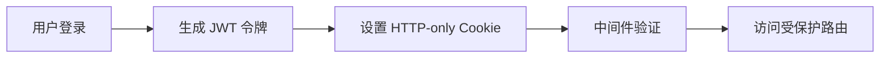
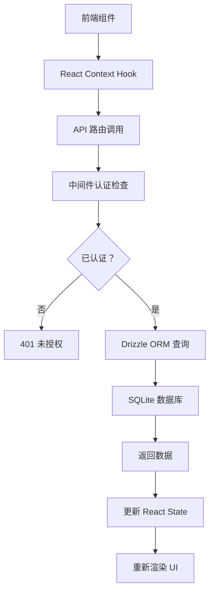
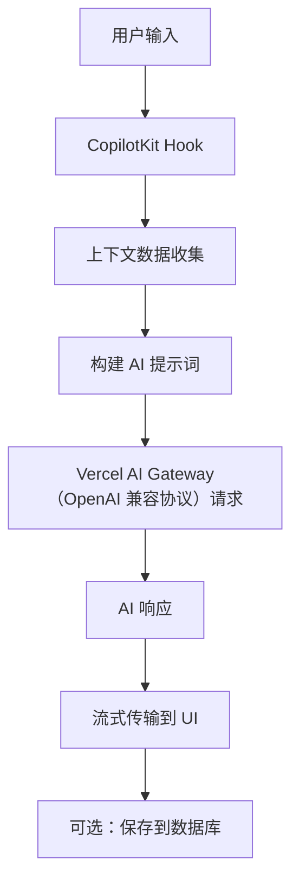

# Study Sphere 工作流程

## 🔄 概述

本文档描述 Study Sphere 中实际的用户工作流程和系统流程。

## 🔐 认证

### 注册流程


### 登录流程


## 📝 笔记工作流程

### 创建笔记流程
```mermaid
flowchart TD
    A[导航到 /dashboard/notes] --> B[点击"添加新笔记"]
    B --> C[在 React Quill 中输入标题和内容]
    C --> D[添加分类/标签]
    D --> E[触发自动保存]
    E --> F[提交到 POST /api/notes]
    F --> G[验证输入]
    G --> H[使用 userId 存入 SQLite]
    H --> I[返回笔记数据]
    I --> J[用新笔记更新 UI]
```

### 管理笔记流程


## 🃏 抽认卡工作流程

### 生成抽认卡流程


### 学习流程


## ❓ 测验系统

### 参加测验
1. 导航到 `/dashboard/quizzes`
2. 从集合中选择测验
3. 启动计时器（5 分钟）
4. 回答选择题
5. 提交答案
6. 计算分数
7. 显示结果

## 🤖 学习伙伴对话

### AI 对话流程


### 对话上下文流程


## 📋 任务管理

### 创建任务
1. 导航到 `/dashboard/todos`
2. 点击"添加任务"
3. 输入标题、描述、优先级、截止日期
4. 提交到 POST `/api/tasks`
5. 存储到 SQLite

### 管理任务
- 更新状态（待处理 → 进行中 → 已完成）
- 编辑任务详情
- 删除任务
- 按状态/优先级过滤

## 📊 每日回顾

### 回顾流程
1. 导航到每日回顾
2. 对生产力评分（1-10 分）
3. 添加反思笔记
4. 提交到 POST `/api/daily-reviews`
5. 查看随时间的进度

## ⚙️ 设置管理

### 用户偏好
1. 导航到设置
2. 配置学习偏好：
   - 工作时间（开始/结束时间）
   - 休息间隔
   - 专注会话时长
   - 高效时段
3. 保存到 PUT `/api/user-settings`

## 🔄 数据流

### 认证流程


### API 通信流程


### AI 集成流程


## 🚫 限制

- 无 WebSocket 连接
- 无实时协作
- 无云存储
- SQLite 仅用于开发
- 基础错误处理
- 以单用户为核心
